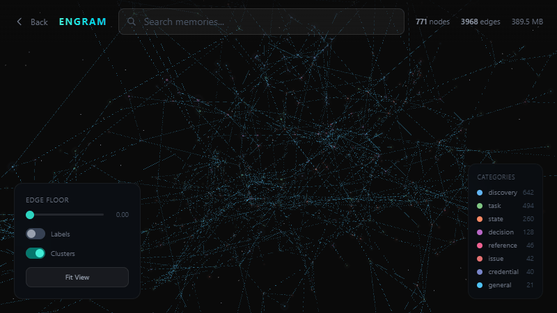

<div align="center">

# Kleos

**Persistent memory and cognitive infrastructure for AI agents. Written in Rust.**

> Formerly known as **engram-rust**. Renamed to Kleos (kleos = Greek for "renown" / "what is remembered").

[](LICENSE) [](https://www.rust-lang.org) [](Cargo.toml)

</div>

<div align="center">

[Why Rust?](#why-rust) · [Quick Start](#quick-start) · [Features](#features) · [Workspace](#workspace) · [Architecture](#architecture) · [API](#api-reference) · [CLI](#cli) · [Sidecar](#sidecar) · [Config](#configuration) · [Wiki](https://github.com/GhostFrame/Kleos/wiki)

</div>

---

## Why Rust?

The original Node.js server worked, but keeping it fast under load was a constant battle. This ground-up Rust rewrite solves that.

This is the ground-up Rust rewrite. Same cognitive model, same API surface, same data format. Different runtime.

- **Single static binary.** `cargo build --release` gives you one file. No Node, no `node_modules`, no flags. The primary binary is `kleos-server`; `engram-server` is a symlink alias in the Docker image.
- **Tokio + Axum.** Async from the socket down to SQLite. Thousands of concurrent agent requests on a small VPS.
- **In-process ONNX.** `ort` runs embeddings and the cross-encoder reranker inside the server process. No Python, no worker threads, no sidecar model server.
- **SQLite + LanceDB.** rusqlite (with optional SQLCipher) holds relational memory and FTS5. LanceDB holds the vector index once the corpus outgrows memory.
- **One workspace.** Library, server, CLI, MCP, sidecar, and credential manager build from one `cargo` command.

One binary. One SQLite database. Local embeddings. No cloud keys required. Your hardware, your data.

---

## Quick Start

```bash
git clone https://github.com/GhostFrame/Kleos.git && cd Engram
cargo build --release
./target/release/kleos-server
```

> Note: the repository will be renamed to `kleos-rust` in a future step. The clone URL above reflects the current name.

Server binds to `127.0.0.1:4200` by default. Set a bootstrap secret, start the server, then claim the admin key:

```bash
# Start the server with a bootstrap secret
KLEOS_BOOTSTRAP_SECRET=my-setup-secret ./target/release/kleos-server

# Bootstrap the admin key (one-time only)
curl -X POST http://localhost:4200/bootstrap \
  -H "Content-Type: application/json" \
  -d '{"secret": "my-setup-secret"}'

# Store a memory
curl -X POST http://localhost:4200/store \
  -H "Authorization: Bearer eg_YOUR_KEY" \
  -H "Content-Type: application/json" \
  -d '{"content": "Production DB is PostgreSQL 16 on db.example.com:5432", "category": "reference"}'

# Search
curl -X POST http://localhost:4200/search \
  -H "Authorization: Bearer eg_YOUR_KEY" \
  -H "Content-Type: application/json" \
  -d '{"query": "database connection info"}'
```

MCP stdio entrypoint:

```bash
KLEOS_MCP_BEARER_TOKEN=eg_... cargo run -p kleos-mcp
```

---




---

## Features

- **FSRS-6 Spaced Repetition.** Memories strengthen with use and decay when ignored. Power-law forgetting with trained parameters.
- **4-Channel Hybrid Search.** Vector similarity, FTS5 full-text, personality signals, and graph traversal fused via Reciprocal Rank Fusion.
- **Knowledge Graph.** Auto-linking, Louvain community detection, weighted PageRank, cooccurrence, structural analysis.
- **Personality Engine.** Preferences, values, motivations, identity. Recall is shaped by the agent's current personality context.
- **Self-Hosted.** One Rust binary. One SQLite database. Local ONNX embeddings. No cloud keys.
- **Encryption at Rest.** SQLCipher database encryption with keyfile, environment variable, or YubiKey HMAC-SHA1 challenge-response.
- **Atomic Fact Decomposition.** Long memories split into self-contained facts. Each fact links back to its parent via `has_fact`.
- **Contradiction Detection.** When agents learn conflicting information, Engram surfaces the conflict.
- **Guardrails.** The gate system checks commands before agents act. Stored rules return allow/warn/block on proposed actions, with optional human-in-the-loop approval.
- **Episodic Memory.** Conversation episodes stored as searchable narratives.
- **Bulk Ingestion.** 11 parsers: Markdown, PDF, HTML, DOCX, CSV, JSONL, ZIP archives, ChatGPT exports, Claude exports, and raw message formats through the async ingestion pipeline.
- **LanceDB Vector Index.** Optional ANN backend for large corpora. Small tenants fall back to in-memory scan.
- **Claude Code Hooks.** Ready-to-use hooks for session memory, context injection, and tool tracking. See [`hooks/README.md`](hooks/README.md).

<details>
<summary><strong>Full Capabilities</strong></summary>

### Smart Memory
- **Dual-Strength Model** (Bjork & Bjork): storage strength never decays, retrieval strength resets on access
- **Versioning**: update memories without losing history, full version chain preserved per user
- **Auto-Deduplication**: SimHash 64-bit locality-sensitive hashing catches near-identical memories
- **Auto-Forget / TTL**: set memories to expire, background sweep via async job worker

### Intelligence Layer
- **Fact Extraction**: structured facts with temporal validity windows (`valid_at`, `invalid_at`)
- **Conversation Extraction**: feed raw chat logs, get structured memories
- **Reflections & Consolidation**: meta-analysis and cluster compression, non-destructive
- **Causal and Valence**: detect cause/effect links and emotional charge on new memories
- **Growth**: self-improving observations from agent activity, stored as growth memories
- **Sentiment Analysis**: emotional tone detection on stored content
- **Predictive**: anticipatory memory retrieval based on usage patterns
- **Reconsolidation**: update existing memory traces when new evidence arrives

### Developer Platform
- **REST API**: 80+ endpoints across 46 route modules
- **Rust CLI**: `kleos-cli` for store, search, context, recall, list, bootstrap, and credential management
- **MCP Server**: `kleos-mcp` for LLM tool integration via Model Context Protocol (stdio; HTTP behind feature flag). 57+ tools across memory, context, graph, intelligence, services, structural, skills, and admin.
- **Sidecar**: `kleos-sidecar` for session-scoped agent runs with batched observation flushing
- **Credential Manager**: `kleos-cred` library + `kleos-credd` daemon for encrypted credential vault with YubiKey and agent key support
- **Client SDKs**: TypeScript (`sdk/typescript/`, `@ghost_frame/kleos`), Python (`sdk/python/`, Pydantic v2 + httpx), Go (`sdk/go/`, stdlib-only)
- **Multi-Tenant + RBAC**: isolated memory per user, role-based access, quota enforcement
- **Webhooks & Digests**: event hooks and scheduled digests
- **Audit Trail**: every mutation logged with who, what, when, from where
- **Scratchpad**: ephemeral working memory with TTL auto-purge

### Coordination Services

Engram includes seven coordination services that share the same auth and database:

- **Axon**: event bus with channels, subscriptions, SSE streaming, cursor polling
- **Brain**: cross-service orchestration primitives, Hopfield networks, spreading activation (feature-gated: `brain_hopfield`)
- **Broca**: structured action log with auto-narration
- **Chiasm**: task tracking with audit trails
- **Loom**: workflow orchestration with step callbacks
- **Soma**: agent registry, heartbeats, capability search, groups
- **Thymus**: rubric-driven quality evaluation and metrics

### Cognitive Layer (Cognithor)
- **Context Routing**: intelligent routing of queries to the right retrieval pipeline
- **Compression**: context compression for token-efficient prompt assembly
- **Tactical**: tactical planning for multi-step retrieval
- **Weight Optimization**: dynamic weight tuning for search channel fusion

### Organization
- **Graph Endpoints**: full memory graph (nodes + edges), timeline, community browse
- **Entities & Projects**: people, servers, tools, projects
- **Review Queue / Inbox**: approve, reject, or edit before memories enter recall
- **Community Detection**: Louvain algorithm surfaces memory clusters
- **PageRank**: structural importance boosts search results

</details>

---

## Workspace

Ten Cargo crates:

| Crate | Role |
|-------|------|
| `kleos-lib` | Core library. Memory, search, embeddings, graph, intelligence, services, auth, jobs, 50+ modules. Previously published as `engram-lib` (last: 0.3.1). |
| `kleos-server` | Axum HTTP server. 46 route modules, middleware (auth, rate limiting, safe mode, JSON depth, metrics), GUI. |
| `kleos-cli` | Command-line client over the HTTP API. Memory ops and credential management via credd. |
| `kleos-sidecar` | Session-scoped memory proxy with file watcher, batched observation flushing, and persistent session store. |
| `kleos-mcp` | MCP (Model Context Protocol) server. 57+ tools across memory, context, graph, intelligence, services, structural, skills, and admin. Stdio transport; HTTP behind feature flag. |
| `kleos-cred` | Credential management library. Crypto primitives, YubiKey challenge-response, key derivation. Previously published as `engram-cred` (last: 0.3.1). |
| `kleos-credd` | Credential management daemon. HTTP server with master key + agent key two-tier auth, ChaCha20-Poly1305 encryption. |
| `kleos-approval-tui` | Terminal UI for human approval workflow. Ratatui-based interactive review queue. (WIP) |
| `kleos-migrate` | ETL tool for migrating from libsql to rusqlite + LanceDB. One-shot utility. |
| `agent-forge` | Structured reasoning CLI: spec-task, consider-approaches, log-hypothesis, log-outcome, recall-errors, verify, challenge-code, checkpoint, rollback, session-learn, session-recall, session-diff, think, declare-unknowns, repo-map, search-code. Tree-sitter AST parsing. |

```bash
cargo build --release --workspace   # build everything
cargo test --workspace               # run the test suite
cargo clippy --workspace             # lint
```

---

<a id="architecture"></a>
<details>
<summary><strong>Architecture</strong></summary>

### Runtime Stack

- **Server**: Axum 0.8 on Tokio, `tower-http` for tracing, CORS, compression (gzip/br/zstd), timeouts
- **Database**: rusqlite with FTS5 and optional SQLCipher encryption, behind a deadpool async connection pool
- **Vector index**: LanceDB (optional, toggled via `use_lance_index`)
- **Embeddings**: BAAI/bge-m3, 1024-dim, ONNX via `ort` with the `tokenizers` crate. Deferred background loading with pre-warm.
- **Reranker**: IBM granite-embedding-reranker-english-r2 INT8 cross-encoder (optional, deferred loading)
- **Decay**: FSRS-6 with trained parameters and power-law forgetting
- **LLM**: optional. Ollama (OpenAI-compatible endpoint) for fact extraction, decomposition, consolidation, growth reflection. Env vars: `OLLAMA_URL`, `OLLAMA_MODEL`. Circuit breaker with configurable threshold and cooldown.
- **Resilience**: `resilience::ServiceGuard` wraps outbound calls to LLM and reranker with circuit breaker, exponential-backoff retry, and a SQLite-backed dead-letter queue (table `service_dead_letters`).
- **Allocator**: mimalloc global allocator
- **Observability**: OpenTelemetry tracing + Prometheus metrics endpoint

### Search Pipeline

Every query fans out across four channels, then merges via Reciprocal Rank Fusion:

1. **Vector similarity**: cosine against bge-m3 embeddings. LanceDB ANN when enabled, in-memory scan otherwise.
2. **FTS5 full-text**: BM25 across content and tags.
3. **Personality signals**: match against extracted preferences, values, identity markers.
4. **Graph relationships**: 2-hop traversal weighted by edge type and PageRank.

Question-type detection (fact recall, preference, reasoning, generalization, timeline) reweights the channels before scoring. The ONNX cross-encoder reranks the top-K for semantic precision.

### Memory Lifecycle

1. **Store**: SimHash checks for near-duplicates. Unique memories get embedded by `ort` and written to SQLite with FTS5 indexing and an optional LanceDB insert.
2. **Auto-link**: the new memory gets compared against existing ones via cosine similarity. Typed edges form: similarity, updates, extends, contradicts, caused_by, prerequisite_for.
3. **FSRS-6 init**: each memory receives starting stability, difficulty, storage strength, retrieval strength.
4. **Fact extraction**: when Ollama is configured, structured facts get pulled with temporal validity windows.
5. **Atomic decomposition**: long memories split into self-contained facts linked to the parent via `has_fact`. The parent stays intact.
6. **Entity cooccurrence**: entities in the same memory update the weighted cooccurrence graph.
7. **Personality extraction**: six signal types scanned: preference, value, motivation, decision, emotion, identity.
8. **Recall**: RRF fuses four channels. Every recalled memory receives an implicit FSRS review graded "Good".
9. **Spaced repetition**: archived or forgotten memories receive "Again". Stable memories can reach months or years between reviews.
10. **Dual-strength decay**: storage strength accumulates. Retrieval strength decays via power law.
11. **Community detection and PageRank**: background workers rerun Louvain grouping and weighted PageRank on a schedule and on dirty-edge thresholds.

### Server Startup

The server initializes in a specific order:

1. Load config (TOML file + env var overrides)
2. Install Prometheus metrics recorder
3. Resolve encryption key (none/keyfile/env/yubikey)
4. Connect to database with optional SQLCipher
5. Spawn background model loading (embedder + reranker -- server starts serving immediately, models load async)
6. Probe local LLM (Ollama) -- graceful degradation if unavailable
7. Initialize brain backend (feature-gated)
8. Check for crash-looping (safe mode activates after 3+ restarts in 5 minutes)
9. Start background tasks: PageRank refresh, auto-checkpoint, job cleanup, vector sync replay, auto-backup

### Security

- `user_id` scoping on every query, including parent lookups during versioning
- Transactional store/update paths with forward-compatible migrations
- FTS5 query sanitization against DoS and injection
- Rate limiting layered inside auth so the limiter sees the resolved tenant
- Pre-auth rate limiting to prevent brute-force
- Bearer-token auth with scope enforcement and audit logging on every mutation
- JSON depth limiting to prevent stack-bomb payloads
- Request body size limit (2 MiB default)
- Request timeout (120s default, tighter per-route: health 1s, search 10s, context 30s)
- Response hardening headers: nosniff, DENY framing, no-referrer, HSTS, no cross-domain policies
- CORS restricted by default (explicit `ENGRAM_ALLOWED_ORIGINS` required for cross-origin access)
- Safe mode: automatic write-blocking after crash-loop detection

### Safe Mode

If the server detects 3+ restarts within 5 minutes, it enters safe mode. In safe mode all write operations are blocked -- reads and searches still work. This prevents a crashing mutation from looping indefinitely.

When safe mode is active the server logs a warning at startup and all write requests return 503 with `"server is in safe mode due to crash loop"`. Reads and searches still work. To exit safe mode after fixing the underlying issue:

```bash
curl -X POST http://localhost:4200/admin/safe-mode/exit \
  -H "Authorization: Bearer eg_YOUR_ADMIN_KEY"
```

### ASCII Diagram

```
+---------------------------------------------------------+
|                  kleos-server (Axum)                     |
|                                                         |
|  +----------+  +----------+  +----------+               |
|  |  FSRS-6  |  |   RRF    |  |  FTS5    |               |
|  |  Engine  |  |  Scorer  |  |  Search  |               |
|  +----+-----+  +----+-----+  +----+-----+               |
|       |             |             |                      |
|  +----+-------------+-------------+----+                 |
|  |  SQLite/SQLCipher + FTS5           |                  |
|  |  + LanceDB (vector ANN, optional)  |                  |
|  +------------------------------------+                  |
|                                                         |
|  +----------+  +----------+  +----------+               |
|  | ort/ONNX |  | Reranker |  |  Graph   |               |
|  |  bge-m3  |  | (Granite)|  |  Engine  |               |
|  +----------+  +----------+  +----------+               |
|                                                         |
|  +----------+  +----------+  +----------+               |
|  | SimHash  |  |Personality| | Temporal |               |
|  |  Dedup   |  |  Engine   | |  Facts   |               |
|  +----------+  +----------+  +----------+               |
|                                                         |
|  +----------+  +----------+  +----------+               |
|  |  Atomic  |  |  Async   |  |Consolida-|               |
|  |  Decomp  |  | Job Pool |  |  tion    |               |
|  +----------+  +----------+  +----------+               |
|                                                         |
|  +----------+  +----------+                             |
|  |Cognithor |  |  Brain   |                             |
|  | Routing  |  | Hopfield |                             |
|  +----------+  +----------+                             |
|                                                         |
|  Services: axon . brain . broca . chiasm .              |
|  loom . soma . thymus                                   |
+---------------------------------------------------------+
```

</details>

<a id="api-reference"></a>
<details>
<summary><strong>API Reference</strong></summary>

Every endpoint needs `Authorization: Bearer eg_...` unless the server runs with no API key configured. Full endpoint documentation is in the [wiki](https://github.com/GhostFrame/Kleos/wiki/API-Reference).

### Core

| Method | Path | Description |
|--------|------|-------------|
| `POST` | `/store` | Store a memory |
| `POST` | `/search` | RRF search across vector, FTS5, personality, and graph channels |
| `POST` | `/context` | Budget-aware context assembly for RAG |
| `GET` | `/list` | List recent memories |
| `GET` | `/graph` | Full memory graph (nodes + edges) |

### Memory Management

| Method | Path | Description |
|--------|------|-------------|
| `POST` | `/memory/:id/update` | Create new version |
| `POST` | `/memory/:id/forget` | Soft delete |
| `POST` | `/memory/:id/archive` | Archive (hidden from recall) |
| `POST` | `/memory/:id/unarchive` | Restore from archive |
| `DELETE` | `/memory/:id` | Permanent delete |
| `GET` | `/versions/:id` | Version chain for a memory |

### FSRS-6

| Method | Path | Description |
|--------|------|-------------|
| `POST` | `/fsrs/review` | Manual review (grade 1-4: Again/Hard/Good/Easy) |
| `GET` | `/fsrs/state` | Retrievability, stability, next review interval |
| `POST` | `/fsrs/init` | Backfill FSRS state for all memories |

### Intelligence

| Method | Path | Description |
|--------|------|-------------|
| `POST` | `/add` | Extract memories from conversations |
| `POST` | `/ingest` | Extract facts from URLs, text, or files |
| `POST` | `/guard` | Pre-action guardrail check (allow/warn/block) |
| `POST` | `/reflect` | Generate period or growth reflection |
| `GET` | `/contradictions` | Find conflicting memories |
| `GET` | `/facts` | Query structured facts |
| `GET` | `/memory-health` | Diagnostic report: stale, duplicates, unlinked |
| `POST` | `/feedback` | Submit retrieval feedback |

### Coordination Services

| Prefix | Service | Highlights |
|--------|---------|------------|
| `/axon/*` | Event bus | publish, subscribe, SSE stream, cursor poll |
| `/broca/*` | Action log | log, narrate, feed, natural-language query |
| `/soma/*` | Agent registry | register, heartbeat, capability search, groups |
| `/thymus/*` | Quality eval | rubrics, scored evaluations, metrics |
| `/loom/*` | Workflows | definitions, runs, step callbacks |
| `/tasks/*` | Chiasm tasks | create, update, audit trail, feed |

### Platform and Admin

| Method | Path | Description |
|--------|------|-------------|
| `POST` | `/users` | Create user (admin) |
| `POST` | `/keys` | Create API key |
| `POST` | `/keys/rotate` | Rotate API key atomically |
| `POST` | `/spaces` | Create scoped memory space |
| `GET` | `/admin/quotas` | View tenant quotas |
| `POST` | `/admin/reembed` | Re-embed with current provider |
| `POST` | `/admin/rebuild-fts` | Rebuild FTS5 index |
| `POST` | `/admin/detect-communities` | Run Louvain community detection |
| `POST` | `/admin/decompose-sweep` | Retroactively decompose memories |
| `POST` | `/admin/compact` | VACUUM and ANALYZE |
| `POST` | `/admin/safe-mode/exit` | Exit crash-loop safe mode |
| `GET` | `/admin/migrations` | Current migration status (version, pending, revertible) |
| `POST` | `/admin/migrations/down` | Roll the schema back to a target version (dry-run supported) |
| `GET` | `/audit` | Query audit log |
| `GET` | `/stats` | Detailed statistics |
| `GET` | `/metrics` | Prometheus metrics |
| `GET` | `/openapi.json` | OpenAPI 3.1 spec |

The full endpoint list (activity, agents, approvals, artifacts, auth_keys, batch, conversations, docs, episodes, errors, fsrs, gate, graph, grounding, growth, gui, health, inbox, ingestion, jobs, loom, onboard, pack, personality, platform, portability, projects, prompts, schema, scratchpad, search, security, sessions, skills, soma, tasks, thymus, webhooks) lives in `kleos-server/src/routes/`.

</details>

<a id="cli"></a>
<details>
<summary><strong>CLI</strong></summary>

`kleos-cli` wraps the HTTP API. Same workspace, same build.

```bash
cargo build --release -p kleos-cli
# or
cargo run -p kleos-cli -- --help
```

```bash
export KLEOS_URL=http://localhost:4200
export KLEOS_API_KEY=eg_your_key
```

```bash
kleos-cli store "Deployed auth migration to production" --category state --importance 0.9
kleos-cli search "deployment history" --limit 5
kleos-cli context "current infrastructure state" --limit 5
kleos-cli recall 42
kleos-cli list --limit 20
kleos-cli delete 42
kleos-cli guard "rm -rf /var/data"
kleos-cli bootstrap
```

### Credential Management (via credd)

```bash
kleos-cli cred get <category> <name>          # get a secret
kleos-cli cred get <category> <name> --raw    # raw value only
kleos-cli cred set <category> <name>          # set (prompted for value)
kleos-cli cred list                           # list all secrets
kleos-cli cred delete <category> <name>       # delete
kleos-cli cred agent-create <name>            # create agent key
kleos-cli cred agent-list                     # list agent keys
kleos-cli cred agent-revoke <name>            # revoke agent key
```

Every command takes `--server` and `--key` overrides, or reads `KLEOS_URL` / `KLEOS_API_KEY` from the environment (the server also accepts the legacy `ENGRAM_URL` / `ENGRAM_API_KEY` names). Credential commands talk to the credd daemon at `CREDD_URL` (default `http://127.0.0.1:4400`).

</details>

<a id="sidecar"></a>
<details>
<summary><strong>Sidecar</strong></summary>

`kleos-sidecar` runs next to a single agent session. It proxies requests to the main Kleos server while providing:

- **Session-scoped context** with local caching for fast recall
- **File watcher** for Claude Code session JSONL files (auto-extracts memories)
- **Batched observation flushing** -- configurable by count (`--batch-size`) and time (`--batch-interval-ms`)
- **Persistent session store** -- optional SQLite-backed session persistence (`--store-path`)
- **Shared-secret auth** -- auto-generated or explicit token for sidecar access
- **Local LLM integration** -- Ollama probe for conversation compression

```bash
KLEOS_URL=http://localhost:4200 \
KLEOS_API_KEY=eg_your_key \
kleos-sidecar --kleos-url http://localhost:4200 --watch
```

Default port: `7711`. The sidecar is a lightweight HTTP service that talks to `kleos-server` for storage and search. It doesn't run embeddings locally.

</details>

<a id="configuration"></a>
<details>
<summary><strong>Configuration</strong></summary>

Configuration is layered: defaults -> TOML file -> environment variable overrides. Env vars always win.

TOML config is loaded from (in order): `KLEOS_CONFIG_FILE` env var, `./kleos.toml` in CWD, or `~/.config/kleos/config.toml`.

> **Env var naming:** `KLEOS_*` is the preferred prefix going forward. The server also reads `ENGRAM_*` equivalents for backward compatibility (the env shim from the rename stage handles the fallback). Both prefixes work; `KLEOS_*` takes precedence when both are set.

Example `kleos.toml`:

```toml
host = "0.0.0.0"
port = 4200
db_path = "/data/kleos.db"
data_dir = "/data"
backup_enabled = true
backup_interval_secs = 21600
pagerank_enabled = true

[encryption]
mode = "keyfile"

[eidolon]
enabled = false
```

Anything not specified falls back to its default. Secret fields (`api_key`, `gui_password`) must be set via env vars -- they cannot appear in the TOML file.

### Core

| Variable | Deprecated alias | Default | Description |
|----------|-----------------|---------|-------------|
| `KLEOS_HOST` | `ENGRAM_HOST` | `127.0.0.1` | Bind address |
| `KLEOS_PORT` | `ENGRAM_PORT` | `4200` | Server port |
| `KLEOS_DB_PATH` | `ENGRAM_DB_PATH` | `kleos.db` (falls back to `engram.db` if present) | SQLite database file |
| `KLEOS_DATA_DIR` | `ENGRAM_DATA_DIR` | `./data` | Data directory for models, LanceDB, artifacts |
| `KLEOS_API_KEY` | `ENGRAM_API_KEY` | unset | Bootstrap admin key override |
| `KLEOS_GUI_PASSWORD` | `ENGRAM_GUI_PASSWORD` | unset | GUI login password |
| `KLEOS_GUI_BUILD_DIR` | `ENGRAM_GUI_BUILD_DIR` | unset | Path to pre-built GUI static assets |
| `KLEOS_DEFAULT_RETENTION` | `ENGRAM_DEFAULT_RETENTION` | `0.9` | Default FSRS retention target for new memories |
| `KLEOS_CONFIG_FILE` | `ENGRAM_CONFIG_FILE` | unset | Override TOML config file path |
| `RUST_LOG` | -- | `info` | `tracing-subscriber` filter: `debug`, `info`, `warn`, `error` |

### Embeddings and Reranker

| Variable | Deprecated alias | Default | Description |
|----------|-----------------|---------|-------------|
| `KLEOS_EMBEDDING_DIM` | `ENGRAM_EMBEDDING_DIM` | `1024` | Embedding dimension |
| `KLEOS_EMBEDDING_MODEL` | `ENGRAM_EMBEDDING_MODEL` | `BAAI/bge-m3` | Embedding model name |
| `KLEOS_EMBEDDING_MODEL_DIR` | `ENGRAM_EMBEDDING_MODEL_DIR` | auto | Override ONNX model directory (must hold `tokenizer.json` + ONNX file) |
| `KLEOS_ONNX_MODEL_FILE` | `ENGRAM_ONNX_MODEL_FILE` | `model_quantized.onnx` | Model filename inside the model dir |
| `KLEOS_EMBEDDING_MAX_SEQ` | `ENGRAM_EMBEDDING_MAX_SEQ` | `512` | Max token sequence length |
| `KLEOS_EMBEDDING_OFFLINE_ONLY` | `ENGRAM_EMBEDDING_OFFLINE_ONLY` | `false` | Block model downloads from HuggingFace |
| `KLEOS_EMBEDDING_CHUNK_MAX_CHARS` | `ENGRAM_EMBEDDING_CHUNK_MAX_CHARS` | `1440` | Max characters per ingestion chunk |
| `KLEOS_EMBEDDING_CHUNK_OVERLAP` | `ENGRAM_EMBEDDING_CHUNK_OVERLAP` | `160` | Overlap between chunks |
| `KLEOS_EMBEDDING_CHUNK_MAX_CHUNKS` | `ENGRAM_EMBEDDING_CHUNK_MAX_CHUNKS` | `6` | Max chunks per document |
| `KLEOS_RERANKER_ENABLED` | `ENGRAM_RERANKER_ENABLED` | `1` | Set `0` to disable cross-encoder reranking |
| `KLEOS_RERANKER_TOP_K` | `ENGRAM_RERANKER_TOP_K` | `12` | Rerank top K candidates |
| `KLEOS_RERANKER_MODEL_DIR` | `ENGRAM_RERANKER_MODEL_DIR` | auto | Override reranker ONNX model directory |
| `KLEOS_USE_LANCE_INDEX` | `ENGRAM_USE_LANCE_INDEX` | `1` | Set `0` to disable the LanceDB vector backend |
| `KLEOS_LANCE_INDEX_PATH` | `ENGRAM_LANCE_INDEX_PATH` | auto | Override LanceDB index directory |
| `KLEOS_VECTOR_DIMENSIONS` | `ENGRAM_VECTOR_DIMENSIONS` | `1024` | Vector dimensions (must match embedding model) |

### LLM (Ollama)

| Variable | Default | Description |
|----------|---------|-------------|
| `OLLAMA_URL` | `http://127.0.0.1:11434/v1/chat/completions` | Ollama OpenAI-compatible endpoint |
| `OLLAMA_MODEL` | `llama3.2:3b` | Default model name |
| `OLLAMA_TIMEOUT_BG_MS` | `60000` | Background request timeout (ms) |
| `OLLAMA_TIMEOUT_HOT_MS` | `5000` | Hot-path request timeout (ms) |
| `OLLAMA_CONCURRENCY` | `1` | Max concurrent requests to Ollama |

The LLM drives fact extraction, decomposition, consolidation, and growth reflection. The core memory pipeline runs without one.

### PageRank and Graph

| Variable | Deprecated alias | Default | Description |
|----------|-----------------|---------|-------------|
| `KLEOS_PAGERANK_ENABLED` | `ENGRAM_PAGERANK_ENABLED` | `1` | Set `0` to skip background PageRank refresh |
| `KLEOS_PAGERANK_REFRESH_INTERVAL` | `ENGRAM_PAGERANK_REFRESH_INTERVAL` | `300` | Worker refresh cadence (seconds) |
| `KLEOS_PAGERANK_DIRTY_THRESHOLD` | `ENGRAM_PAGERANK_DIRTY_THRESHOLD` | `100` | Dirty-edge count that forces a refresh |
| `KLEOS_PAGERANK_MAX_CONCURRENT` | `ENGRAM_PAGERANK_MAX_CONCURRENT` | `2` | Max concurrent PageRank workers |

### Backup

| Variable | Deprecated alias | Default | Description |
|----------|-----------------|---------|-------------|
| `KLEOS_BACKUP_ENABLED` | `ENGRAM_BACKUP_ENABLED` | `false` | Enable auto-backup background task |
| `KLEOS_BACKUP_INTERVAL_SECS` | `ENGRAM_BACKUP_INTERVAL_SECS` | `21600` | Seconds between backups (default: 6 hours) |
| `KLEOS_BACKUP_DIR` | `ENGRAM_BACKUP_DIR` | `backups` | Backup directory (relative to data_dir) |
| `KLEOS_BACKUP_RETENTION` | `ENGRAM_BACKUP_RETENTION` | `14` | Max hourly backup files to retain |
| `KLEOS_BACKUP_RETENTION_DAILY` | `ENGRAM_BACKUP_RETENTION_DAILY` | `30` | Max daily backup files to retain |

### Encryption at Rest

Encryption is **off by default**. Kleos runs with a plain SQLite database out of the box. To enable SQLCipher encryption, set `KLEOS_ENCRYPTION_MODE` (or the deprecated `ENGRAM_ENCRYPTION_MODE`) to one of:

| Mode | Description |
|------|-------------|
| `none` | No encryption (default). Database opens without `PRAGMA key`. |
| `keyfile` | Read a 32-byte raw key from `~/.config/kleos/dbkey`. File must be `chmod 600` on Unix. |
| `env` | Read `KLEOS_DB_KEY` environment variable (64 hex characters = 32 bytes). |
| `yubikey` | Derive key from YubiKey HMAC-SHA1 challenge-response (slot 2) via Argon2id. |

**Keyfile setup:**

```bash
head -c 32 /dev/urandom > ~/.config/kleos/dbkey
chmod 600 ~/.config/kleos/dbkey
KLEOS_ENCRYPTION_MODE=keyfile kleos-server
```

**Environment variable setup:**

```bash
export KLEOS_DB_KEY=$(head -c 32 /dev/urandom | xxd -p -c 64)
KLEOS_ENCRYPTION_MODE=env kleos-server
```

**YubiKey setup:**

YubiKey mode uses HMAC-SHA1 challenge-response (slot 2) to derive the encryption key via Argon2id. The YubiKey must be present to unlock the database. Cold starts take about 1 second (64 MiB memory, 3 iterations). Once unlocked, the key stays in memory until the process exits.

```bash
ykman otp chalresp --generate 2
kleos-credd --encryption-mode yubikey
KLEOS_ENCRYPTION_MODE=yubikey kleos-server
```

### Security

| Variable | Deprecated alias | Default | Description |
|----------|-----------------|---------|-------------|
| `KLEOS_BOOTSTRAP_SECRET` | `ENGRAM_BOOTSTRAP_SECRET` | unset | Pre-shared secret required for `POST /bootstrap`. Disabled when unset. |
| `KLEOS_TRUSTED_PROXIES` | `ENGRAM_TRUSTED_PROXIES` | unset | Comma-separated IPs of trusted reverse proxies (for X-Forwarded-For) |
| `KLEOS_ALLOWED_ORIGINS` | `ENGRAM_ALLOWED_ORIGINS` | unset | Comma-separated origins for CORS (restricted by default) |
| `KLEOS_AUTH_KEY_ROTATION_GRACE_HOURS` | `ENGRAM_AUTH_KEY_ROTATION_GRACE_HOURS` | `24` | Grace period for old key after rotation |

See `kleos-lib/src/config.rs` for the full set, including Eidolon, gate, growth, sessions, and prompt configuration.

</details>

---

## Development

```bash
cargo check --workspace                 # verify it compiles
cargo test --workspace                  # run tests (in-memory SQLite)
cargo test -p kleos-lib                 # library only
cargo test -p kleos-server              # server only
cargo clippy --workspace -- -D warnings # lint
```

See [CONTRIBUTING.md](CONTRIBUTING.md) for the development workflow and codebase patterns.

---

<div align="center">

[Wiki](https://github.com/GhostFrame/Kleos/wiki) · [Issues](https://github.com/GhostFrame/Kleos/issues)

Elastic License 2.0

</div>
